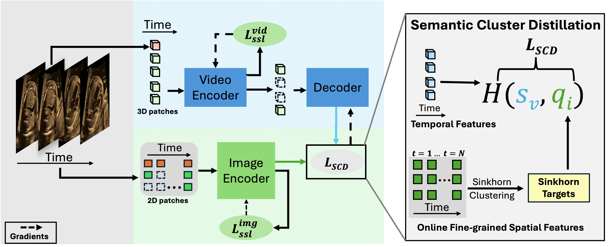

# DISCOVR: Self-supervised Learning of Echocardiographic Video Representations

[[Paper](https://arxiv.org/abs/XXXX.XXXXX)] [[Code](https://github.com/yourusername/discovr)]

DISCOVR (Distilled Image Supervision for Cross Modal Video Representation) is a self-supervised dual branch framework for cardiac ultrasound video representation learning. It addresses the unique challenges in echocardiography by combining temporal dynamics modeling with fine-grained spatial semantics extraction.

## Architecture



*DISCOVR's dual branch architecture combines a clustering-based video encoder with an online image encoder, connected through semantic cluster distillation. The video branch captures temporal dynamics while the image branch extracts fine-grained spatial semantics, enabling rich representation learning for echocardiographic videos.*

## Key Features

- **Dual Branch Architecture**: Combines a clustering-based video encoder for temporal dynamics with an online image encoder for fine-grained spatial semantics
- **Semantic Cluster Distillation**: Transfers anatomical knowledge from the evolving image encoder to the video encoder
- **Temporally Coherent Representations**: Enables rich semantic understanding while maintaining temporal coherence
- **Domain-Specific Design**: Specifically optimized for echocardiographic video analysis
- **Robust to Ultrasound Challenges**: Handles high intersample similarity and low PSNR inputs common in ultrasound
- **Extensive Evaluation**: Validated on 6 large-scale echocardiographic datasets spanning fetal, pediatric, and adult populations
- **State-of-the-Art Performance**: Achieves superior results across multiple tasks:
  - **Segmentation**: Highest Dice score of 0.844 on CAMUS dataset, outperforming specialized architectures (UNet, DeepLabV3) and other SSL methods
  - **Zero-Shot Classification**: Best balanced accuracy and F1 scores across all echocardiography datasets:
    - Echonet Dynamic: F1 of 61.45 (vs 57.56 baseline)
    - FetalEcho 1: F1 of 61.79 (vs 60.64 baseline)
  - **Anomaly Detection**: Superior performance in detecting subtle cardiac structures and abnormalities

## Performance Highlights

### Segmentation Performance
- DISCOVR achieves Dice score of 0.844, outperforming:
  - Specialized architectures: UNet (0.816), DeepLabV3 (0.819)
  - SSL-based video models: VideoMAE (0.747), MGMAE (0.767), SIGMA (0.759)
- Superior performance on challenging structures:
  - Left atrium segmentation: Dice = 0.90 (vs 0.01 for MGMAE, 0.30 for SIGMA, 0.56 for VideoMAE)

### Zero-Shot Classification
- Best performance across all evaluated datasets:
  - Echonet Dynamic: F1 = 61.45, Balanced Accuracy = 63.20%
  - FetalEcho 1: F1 = 61.79
- Consistent improvements across fetal, pediatric, and adult cardiac cohorts

### Ablation Studies
- **Loss Components**: Combined Lvid_ssl and LSCD achieves F1 = 61.45% (vs 48.23% with Lvid_ssl alone)
- **Backbone Size**: ViT-Base (F1=61.45%) outperforms ViT-Small (F1=57.52%)
- **Temporal Length**: Best performance with 64 frames (F1=61.45%)
- **Masking Ratio**: Optimal performance with 90% masking (F1=61.45%)

## Installation

1. Clone the repository:
```bash
git clone https://github.com/yourusername/discovr.git
cd discovr
```

2. Create a conda environment and install dependencies:
```bash
conda create -n discovr python=3.10.13
conda activate discovr

# Install PyTorch with CUDA 11.8 support
pip install torch==2.6.0 torchvision==0.21.0 torchaudio==2.6.0 --index-url https://download.pytorch.org/whl/cu118

# Install FFmpeg (required for TorchCodec)
conda install ffmpeg -c conda-forge

# Install TorchCodec with CUDA support
pip install torchcodec --index-url https://download.pytorch.org/whl/cu118

# For more information on building TorchCodec from source, visit:
# https://github.com/pytorch/torchcodec

# Install remaining dependencies
pip install -r requirements.txt
```

## Project Structure

```
discovr/
├── config/             # Configuration files
├── data/              # Data loading and processing modules
├── engine/            # Training and evaluation engines
├── models/            # Model architectures
├── scripts/           # Training and evaluation scripts
├── utils/             # Utility functions
├── requirements.txt   # Python dependencies
└── setup.py          # Package installation file
```

## Usage

### Pretraining

To pretrain the model on echocardiographic videos:

```bash
python -m torch.distributed.launch --nproc_per_node=NUM_GPUS \
    scripts/run_mae_pretraining.py \
    --data_path /path/to/echo_videos \
    --data_path_csv /path/to/train.csv \
    --data_path_val /path/to/val.csv \
    --data_path_test /path/to/test.csv \
    --mask_type multi_local \
    --loss_func SIGMA \
    --model pretrain_videomae_base_patch16_224 \
    --batch_size 48 \
    --num_frames 64 \
    --opt adamw \
    --opt_betas 0.9 0.95 \
    --warmup_epochs 40 \
    --epochs 400
```

## Requirements

- Python 3.10+
- PyTorch 2.6.0+
- CUDA 11.8+
- Other dependencies listed in requirements.txt

## Citation

If you use this code in your research, please cite:

```bibtex
@article{discovr2024,
  title={Self-supervised Learning of Echocardiographic Video Representations via Online Cluster Distillation},
  author={Anonymous Author(s)},
  journal={arXiv preprint arXiv:XXXX.XXXXX},
  year={2024}
}
```

[Read the paper on arXiv](https://arxiv.org/abs/XXXX.XXXXX)

## License

This project is licensed under the MIT License - see the LICENSE file for details.

## Acknowledgments

- VideoMAE: [https://github.com/MCG-NJU/VideoMAE](https://github.com/MCG-NJU/VideoMAE)
- SIGMA: [https://github.com/QUVA-Lab/SIGMA/](https://github.com/QUVA-Lab/SIGMA/)
- DINO: [https://github.com/facebookresearch/dino](https://github.com/facebookresearch/dino)