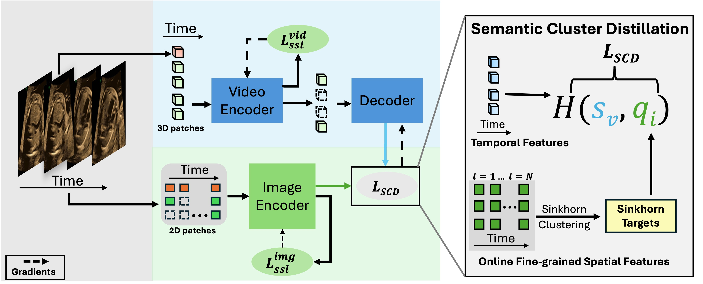

# DISCOVR: Self-supervised Learning of Echocardiographic Video Representations via Online Cluster Distillation (NeurIPS 2025)

 [](https://arxiv.org/abs/2506.11777)  [](https://huggingface.co/Div97/DISCOVR_ADULT_PEDIATRIC_MODEL)

DISCOVR (Distilled Image Supervision for Cross Modal Video Representation) is a self-supervised dual branch framework for cardiac ultrasound video representation learning. It addresses the unique challenges in echocardiography by combining temporal dynamics modeling with fine-grained spatial semantics extraction.

## Architecture



*DISCOVR's dual branch architecture combines a clustering-based video encoder with an online image encoder, connected through semantic cluster distillation. The video branch captures temporal dynamics while the image branch extracts fine-grained spatial semantics, enabling rich representation learning for echocardiographic videos.*

## Key Features

- **Dual Branch Architecture**: Combines a clustering-based video encoder for temporal dynamics with an online image encoder for fine-grained spatial semantics
- **Semantic Cluster Distillation**: Transfers anatomical knowledge from the evolving image encoder to the video encoder
- **Temporally Coherent Representations**: Enables rich semantic understanding while maintaining temporal coherence
- **Domain-Specific Design**: Specifically optimized for echocardiographic video analysis
- **Robust to Ultrasound Challenges**: Handles high intersample similarity and low PSNR inputs common in ultrasound
- **Extensive Evaluation**: 
  - Validated across fetal, pediatric, and adult populations using 6 cardiac ultrasound datasets.
  - Evaluated on zero-shot and linear probing, video anomaly detection, and cardiac segmentation tasks
  - Compared against baselines from video anomaly detection, video SSL, and specialized segmentation architectures

## Installation

1. Clone the repository:
```bash
git clone https://github.com/mdivyanshu97/DISCOVR.git
cd discovr
```

2. Create a conda environment and install dependencies:
```bash
conda create -n discovr python=3.10.13
conda activate discovr

# Install PyTorch with CUDA 11.8 support
pip install torch==2.6.0 torchvision==0.21.0 torchaudio==2.6.0 --index-url https://download.pytorch.org/whl/cu118

# Install FFmpeg (required for TorchCodec)
conda install ffmpeg -c conda-forge

# Install TorchCodec with CUDA support
pip install torchcodec --index-url https://download.pytorch.org/whl/cu118

# For more information on building TorchCodec from source, visit:
# https://github.com/pytorch/torchcodec

# Install remaining dependencies
pip install -r requirements.txt
```

## Project Structure

```
discovr/
├── config/             # Configuration files
├── data/              # Data loading and processing modules
├── engine/            # Training and evaluation engines
├── models/            # Model architectures
├── scripts/           # Training and evaluation scripts
├── utils/             # Utility functions
├── requirements.txt   # Python dependencies
└── setup.py          # Package installation file
```

## Model Card

### Pretrained Checkpoints

We release checkpoints trained on adult and pediatric echocardiography datasets (EchoNet Dynamic, EchoPediatric LVH, RVENet) at different training stages.

#### Training Details

| Model | Epochs Trained | FetalEcho1 | FetalEcho2 | EchoNet Dynamic | EchoPediatric LVH | RVENet |
|-------|----------------|------------|------------|------------------|-------------------|--------|
| [DISCOVR-200](https://huggingface.co/Div97/DISCOVR_ADULT_PEDIATRIC_MODEL/blob/main/checkpoint-199.pth) | 200 | x | x | ✓ | ✓ | ✓ |
| [DISCOVR-300](https://huggingface.co/Div97/DISCOVR_ADULT_PEDIATRIC_MODEL/blob/main/checkpoint-299.pth) | 300 | x | x | ✓ | ✓ | ✓ |
| [DISCOVR-400](https://huggingface.co/Div97/DISCOVR_ADULT_PEDIATRIC_MODEL/blob/main/checkpoint-399.pth) | 400 | x | x | ✓ | ✓ | ✓ |
| [DISCOVR-500](https://huggingface.co/Div97/DISCOVR_ADULT_PEDIATRIC_MODEL/blob/main/checkpoint-499.pth) | 500 | x | x | ✓ | ✓ | ✓ |
| [DISCOVR-600](https://huggingface.co/Div97/DISCOVR_ADULT_PEDIATRIC_MODEL/blob/main/checkpoint-599.pth) | 600 | x | x | ✓ | ✓ | ✓ |
| [DISCOVR-700](https://huggingface.co/Div97/DISCOVR_ADULT_PEDIATRIC_MODEL/blob/main/checkpoint-699.pth) | 700 | x | x | ✓ | ✓ | ✓ |
| [DISCOVR-800](https://huggingface.co/Div97/DISCOVR_ADULT_PEDIATRIC_MODEL/blob/main/checkpoint-799.pth) | 800 | x | x | ✓ | ✓ | ✓ |

## Usage

### Pretraining

To pretrain the model on echocardiographic videos:

```bash
python -m torch.distributed.launch --nproc_per_node=NUM_GPUS \
    scripts/run_mae_pretraining.py \
    --data_path /path/to/echo_videos \
    --data_path_csv /path/to/train.csv \
    --data_path_val /path/to/val.csv \
    --data_path_test /path/to/test.csv \
    --mask_type multi_local \
    --loss_func SIGMA \
    --model pretrain_videomae_base_patch16_224 \
    --batch_size 48 \
    --num_frames 64 \
    --opt adamw \
    --opt_betas 0.9 0.95 \
    --warmup_epochs 40 \
    --epochs 400
```

### Using the pretrained encoder for inference

After pretraining (or using any of the checkpoints listed in the *Pretrained Checkpoints* table above), you can load the DISCOVR video encoder and run inference using the helper script `run_discovr_encoder.py`:

```bash
cd /path/to/discovr

python run_discovr_encoder.py \
  --checkpoint /path/to/checkpoint-799.pth \
  --num_frames 64 \
  --batch_size 2 \
  --device cuda
```

This script:
- Instantiates the DISCOVR pretraining architecture with the correct configuration
- Loads the checkpoint weights
- Selects the `video_teacher` branch when available
- Runs a dummy video tensor through the encoder and prints the CLS token feature shape

You can adapt this script to replace the dummy input with your own preprocessed echocardiography videos and to save the extracted features to disk.

## Requirements

- Python 3.10+
- PyTorch 2.6.0+
- CUDA 11.8+
- Other dependencies listed in requirements.txt

## Citation

If you use this code in your research, please cite:

```bibtex
@article{discovr2024,
  title={Self-supervised Learning of Echocardiographic Video Representations via Online Cluster Distillation},
  author={Anonymous Author(s)},
  journal={arXiv preprint arXiv:XXXX.XXXXX},
  year={2024}
}
```

[Read the paper on arXiv](https://arxiv.org/abs/XXXX.XXXXX)

## License

This project is licensed under the MIT License - see the LICENSE file for details.

## Acknowledgments

- VideoMAE: [https://github.com/MCG-NJU/VideoMAE](https://github.com/MCG-NJU/VideoMAE)
- SIGMA: [https://github.com/QUVA-Lab/SIGMA/](https://github.com/QUVA-Lab/SIGMA/)
- DINO: [https://github.com/facebookresearch/dino](https://github.com/facebookresearch/dino)